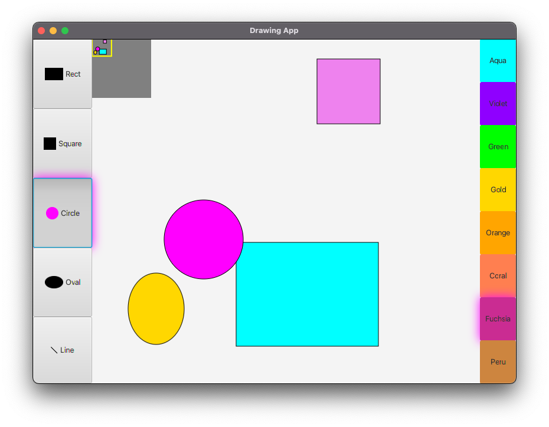

# Drawing Application
A basic drawing application which allows the user to create and manipulate shapes on the canvas.

# Overview
* This repository contains all the code for the application which was built using the latest 
features of Java 17 and JavaFX framework. 
* Implemented using Model-View-Controller architecture, Publish-Subscribe communication model and 2D Graphics.

# Supported Actions
1) Choose a shape from the left side-bar.
2) Choose a colour from the right side-bar.
3) Create a new shape by click and drag of the left-mouse button.
4) Select a shape by left click.
5) Resize a selected shape by left click and drag on the resize handle. 
6) Move a shape by left click and drag.
7) Delete a selected shape by pressing the `Delete` key.
8) Pan the view-finder of the mini-view on the top left corner by dragging the yellow rectangle.
9) Pan the view-port of the main canvas by right click and drag. 

# Instructions for Running the Application
1) Please download the full source code or clone this repository. 
2) Open the folder as an existing project in your IDE of choice (I use IntelliJ).
3) Navigate to `/src/java/com/example/drawing_application/`.
4) Open the main file which starts the application named `DrawingApp.java`.
5) Run the `main` method by clicking on the play button in the gutter.
